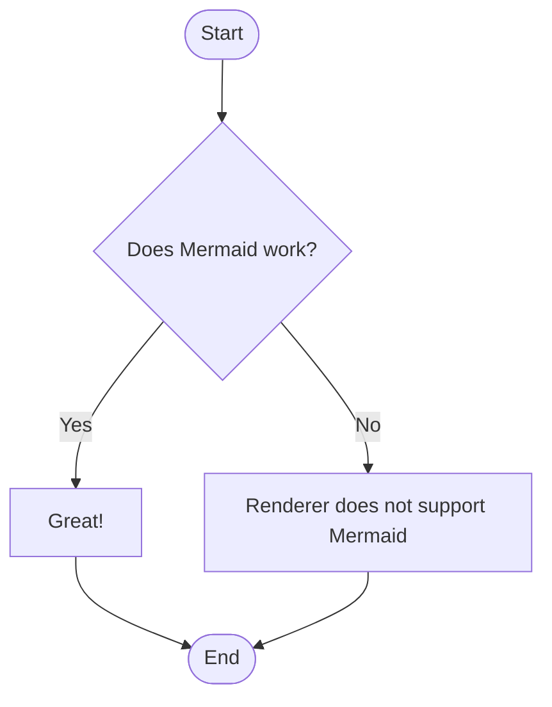
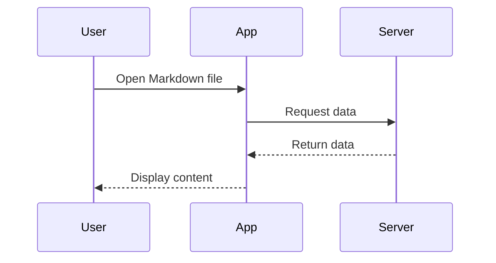
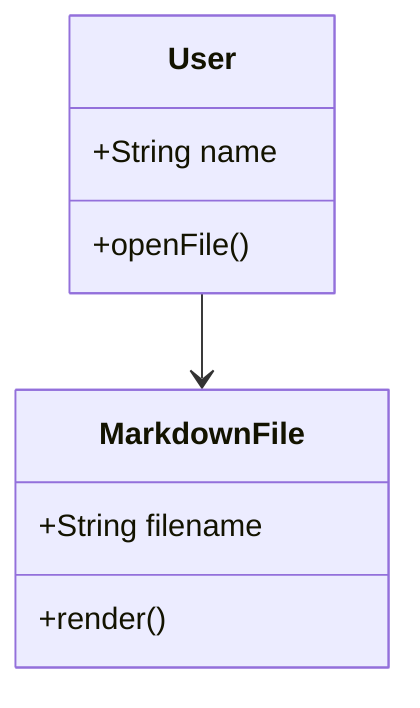
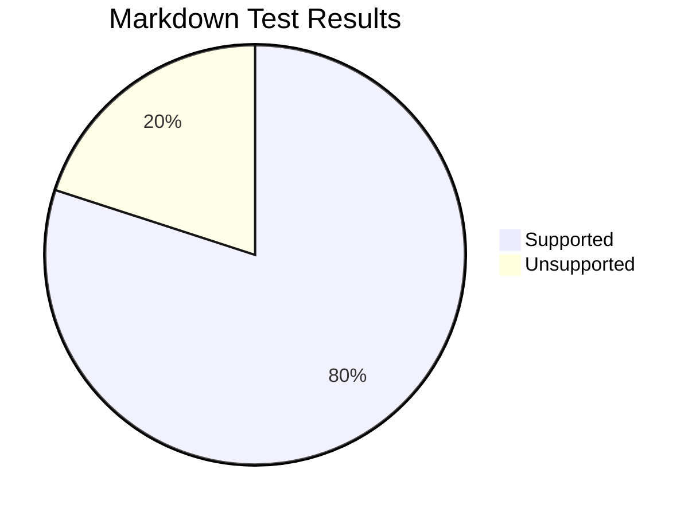

# Advanced Markdown Features

## 1. Footnotes

Markdown can support footnotes.[^first]

Here is another reference.[^second]

[^first]: This is the first footnote.
[^second]: This is the second footnote with **formatting**.

---

## 2. Collapsible Content

<details>
<summary><strong>Click to expand this section</strong></summary>

### Hidden Heading

This content is inside a collapsible section.

- Hidden item 1
- Hidden item 2

```python
print("Hidden code")
```

</details>

---

## 3. GitHub-Style Alerts

> [!NOTE]
> This is a note.

> [!TIP]
> This is a useful tip.

> [!IMPORTANT]
> This information is important.

> [!WARNING]
> Be careful before continuing.

> [!CAUTION]
> This action could be dangerous.

---

## 4. Mathematics

Inline math:

$E = mc^2$

Quadratic equation:

$$
x = \frac{-b \pm \sqrt{b^2 - 4ac}}{2a}
$$

Pythagorean theorem:

$$
a^2 + b^2 = c^2
$$

---

## 5. Mermaid Flowchart



---

## 6. Mermaid Sequence Diagram



---

## 7. Mermaid Class Diagram



---

## 8. Mermaid Pie Chart



---

## 9. Definition List

Markdown
: A lightweight markup language.

Renderer
: Software that converts Markdown into formatted output.

---

## 10. HTML Table

<table>
<tr>
<th>Feature</th>
<th>HTML Test</th>
</tr>
<tr>
<td>Bold</td>
<td><strong>Works?</strong></td>
</tr>
<tr>
<td>Italic</td>
<td><em>Works?</em></td>
</tr>
</table>

---

## 11. Raw HTML

<div style="padding: 10px; border: 1px solid gray;">
<strong>HTML container test</strong><br>
If this looks styled, your renderer allows HTML and possibly inline CSS.
</div>

---

## 12. Emoji Shortcodes

:rocket: :fire: :smile: :heart:

Shortcode support depends on the Markdown renderer.

---

## Advanced Test Complete

Check which sections render correctly and which sections remain plain text.
