# Work Split & Team Allocation — Zero-Dep Markdown Viewer

> **Zero Dependency Hackathon · Track B (Parsers & Data Formats)**  
> **Duration:** 72 Hours · **Stack:** C23 (stdlib only, raw POSIX sockets) + Vanilla Browser JS  
> **Target:** Overleaf-style bidirectional Markdown ↔ HTML live editor with zero dependencies, compiler-style caret diagnostics, CommonMark conformance, and provable fixed-point round-trip convergence.

---

## 1. Executive Summary & Team Structure

To maximize throughput across the 72-hour timeline and eliminate blocking dependencies, the workload is divided into **3 clear, decoupled ownership domains**:

```
┌────────────────────────────────────────────────────────────────────────────────────────────────────────┐
│                                       72-HOUR WORKLOAD ALLOCATION                                      │
├──────────────────────────────────┬──────────────────────────────────┬──────────────────────────────────┤
│    MEMBER 1: PARSER & ERRORS     │ MEMBER 2: SERIALIZER & FUZZING   │  MEMBER 3: SYSTEMS & FRONTEND    │
│  "The Compiler / Frontend Lead"  │ "The Correctness & Fuzzing Lead" │  "The Systems & Fullstack Lead"  │
├──────────────────────────────────┼──────────────────────────────────┼──────────────────────────────────┤
│ • Tokenizer & Line/Col tracker   │ • HTML DOM fragment parser       │ • Raw POSIX socket HTTP/1.1      │
│ • Recursive-descent MD Parser    │ • Scoped tag-to-MD Serializer    │ • Routing & JSON extraction      │
│ • Caret-annotated Error Engine   │ • Context-aware escaping logic   │ • Atomic debounced File Writer   │
│ • CommonMark Conformance runner  │ • Fixed-point round-trip fuzzer  │ • Vanilla HTML/CSS/JS Dumb Client│
│ • AST construction & HTML escape │ • Sanitizers (ASan/UBSan/Valgrind│ • Build System (Makefile/Single) │
│ • Parser edge cases & fixtures   │ • Coverage metrics (gcov/lcov)   │ • Submission & Demo Video Script │
└──────────────────────────────────┴──────────────────────────────────┴──────────────────────────────────┘
```

---

## 2. Team Member Ownership Profiles

### Member 1: Parser & Compiler Lead (Markdown → HTML & Error Diagnostics)
* **Core Mission:** Convert raw Markdown into well-formed HTML, track precise source coordinates, and produce compiler-grade caret error diagnostics.
* **Key Deliverables:**
  1. `src-c/tokenizer.h` / `src-c/tokenizer.c`
  2. `src-c/md_parser.h` / `src-c/md_parser.c`
  3. `src-c/error_report.h` / `src-c/error_report.c` (shared caret snippet renderer)
  4. `tests/test_tokenizer.c` & `tests/test_md_parser.c`
  5. `tests/commonmark/run_conformance.c` & test fixture setup
* **Skills Utilized:** Recursive-descent parsing, EBNF grammar translation, lookahead/backtracking, delimiter stack management, character encoding handling.

---

### Member 2: Serializer & Correctness Lead (HTML → Markdown & Fuzzer)
* **Core Mission:** Convert HTML preview mutations back into Markdown, enforce lossless/deterministic transforms, and prove bidirectional stability using automated fuzzing and sanitizers.
* **Key Deliverables:**
  1. `src-c/html_serializer.h` / `src-c/html_serializer.c`
  2. `tests/test_html_serializer.c`
  3. `tests/fuzz_roundtrip.c` (grammar-aware & mutation fuzzer)
  4. Sanitizer (`ASan`, `UBSan`), Valgrind leak-free auditing, and `gcov`/`lcov` test coverage generation
  5. Authoring correctness & conformance sections of `docs/STDLIB.md`
* **Skills Utilized:** DOM tree traversal, reverse serialization rules, fuzzing and minimal test-case reduction, sanitizer diagnostics, C memory management.

---

### Member 3: Systems, Desktop Engine & Frontend Lead (Platform, Sockets, Disk I/O, UI & Packaging)
* **Core Mission:** Build the cross-platform zero-dependency desktop socket engine, platform abstraction layer (`platform.h`), atomic debounced file writer, local desktop UI, seamless multi-platform build pipeline, and final submission artifacts.
* **Key Deliverables:**
  1. `src-c/platform.h` / `src-c/platform.c` (cross-platform Win32/POSIX sockets, atomic file replace, desktop window launcher)
  2. `src-c/main.c` (CLI entry point, argument parsing, graceful shutdown, desktop app auto-launch)
  3. `src-c/http.h` / `src-c/http.c` (cross-platform raw sockets, HTTP/1.1 parser, routing)
  4. `src-c/file_writer.h` / `src-c/file_writer.c` (debounced atomic write via `fsync` / `FlushFileBuffers` + atomic rename)
  5. `src-c/static/index.html`, `styles.css`, `client.js` (two-pane Overleaf UI, debounce, caret error banner)
  6. `src-c/Makefile` (targets: `all`, `single`, `asan`, `coverage`, `fuzz`, `commonmark`, `test`, Windows MinGW compatibility)
  7. Submission files: `.zero-dep.toml`, `deps-proof.txt`, demo video recording & packaging
* **Skills Utilized:** POSIX and Winsock2 socket APIs, cross-platform systems programming, atomic file operations, vanilla JavaScript / CSS layout, build automation.

---

## 3. Strict Interface Contracts (Parallel Work Guarantee)

To ensure all 3 members can write code simultaneously from Hour 0 without merge conflicts or blocking on incomplete dependencies, the following C header interfaces are frozen at project kickoff:

### Interface 1: Markdown Parser (`src-c/md_parser.h`)
*Owner: Member 1 · Consumers: Member 2 (for fuzzer), Member 3 (for HTTP `/render`)*
```c
#ifndef MD_PARSER_H
#define MD_PARSER_H

#include <stddef.h>
#include <stdbool.h>

typedef struct {
    bool   success;
    char  *html;          // Allocated string on success; NULL on error
    char  *error_msg;     // e.g. "unmatched '**' delimiter"
    char  *caret_snippet; // Compiler-style formatted 3-line error snippet
    size_t line;          // 1-indexed
    size_t col;           // 1-indexed
} md_parse_result_t;

// Parses Markdown buffer and returns HTML or structured error
md_parse_result_t md_to_html(const char *md_src, size_t md_len);

// Frees all internal allocations within md_parse_result_t
void md_parse_result_free(md_parse_result_t *res);

#endif
```

### Interface 2: HTML Serializer (`src-c/html_serializer.h`)
*Owner: Member 2 · Consumers: Member 1 (for round-trip tests), Member 3 (for HTTP `/serialize`)*
```c
#ifndef HTML_SERIALIZER_H
#define HTML_SERIALIZER_H

#include <stddef.h>
#include <stdbool.h>

typedef struct {
    bool  success;
    char *markdown;       // Allocated string on success; NULL on error
    char *error_msg;      // Descriptive error message if fragment is malformed
} html_serialize_result_t;

// Converts rendered HTML back into clean, canonical Markdown
html_serialize_result_t html_to_md(const char *html_src, size_t html_len);

// Frees internal allocations within html_serialize_result_t
void html_serialize_result_free(html_serialize_result_t *res);

#endif
```

### Interface 3: Atomic File Writer (`src-c/file_writer.h`)
*Owner: Member 3 · Consumer: Member 3 (`http.c` / `main.c`)*
```c
#ifndef FILE_WRITER_H
#define FILE_WRITER_H

#include <stdbool.h>
#include <stddef.h>

// Atomically writes content to target_path via .tmp file + fsync + rename
bool file_writer_atomic_write(const char *target_path, const char *content, size_t len);

// Triggers debounced write request (150-300ms delay)
void file_writer_schedule_save(const char *target_path, const char *content, size_t len);

#endif
```

---

## 4. Phase-by-Phase Task Breakdown (72-Hour Roadmap)

```mermaid
gantt
    title 72-Hour Zero-Dep Markdown Viewer Roadmap
    dateFormat  X
    axisFormat Hour %d
    section Member 1 (Parser)
    Tokenizer & Line/Col Engine      :0, 18
    Block & Inline MD Parsers        :18, 36
    Caret Error Engine & Conformance :36, 48
    Integration & Edge Cases         :48, 56
    Conformance Polish & Docs        :56, 72

    section Member 2 (Serializer)
    HTML Fragment Tokenizer/DOM Tree :0, 18
    Tag Walker & Context Escaper     :18, 36
    Round-Trip Fuzzer & Sanitizers   :36, 48
    Bidirectional Convergence Tests  :48, 56
    STDLIB.md (≥10 entries) & Docs   :56, 72

    section Member 3 (Systems & UI)
    Raw Sockets HTTP & Client UI     :0, 18
    Atomic File Writer & Endpoints   :18, 36
    End-to-End Sync Wiring           :36, 48
    Make Targets (Single/ASan/Cov)   :48, 56
    Demo Video & Final Submission    :56, 72
```



---

### Phase 0: Pre-Hackathon Setup (Hour 0)
*Hard rule: Docs and design only, no project code committed before kickoff.*

| Member | Primary Tasks | Deliverables |
|---|---|---|
| **Member 1** | Finalize EBNF grammar, token types enum, delimiter-stack rules for overlapping inline syntax (`**a *b** c*`). | Grammar spec & token state diagrams |
| **Member 2** | Design scoped HTML tag dictionary, sequential list renumbering contract, round-trip convergence invariant formulas. | Tag mapping table & fuzzer assertion math |
| **Member 3** | Setup Makefile skeleton, environment verification (`gcc`, `valgrind`, `gcov`, `clang`), scaffold `.zero-dep.toml`, `deps-proof.txt` generation plan. | Toolchain verification & repo scaffolding |

---

### Phase 1: Foundation (Hours 0–10)

| Member | Focus | Concrete Action Items |
|---|---|---|
| **Member 1** | **Tokenizer Architecture** | • Define `token_t` with `type`, `start`, `len`, `line`, `col`<br>• Implement `tokenizer_init()` and `tokenizer_next()`<br>• Implement newline tracking and column calculations<br>• Handle character escaping (`\*`, `\_`, `\[`, `\``) |
| **Member 2** | **HTML Fragment Walker Skeleton** | • Design lightweight `html_node_t` struct (`tag`, `attrs`, `children`, `text`)<br>• Implement minimal tag-scanner for known tags (`<h1>`–`<h6>`, `<strong>`, `<em>`, `<ul>`, `<ol>`, `<li>`, `<pre><code>`, `<code>`, `<blockquote>`, `<a>`, `<p>`, `<br>`)<br>• Create unit test harness `tests/test_html_serializer.c` with assertion macros |
| **Member 3** | **Raw POSIX HTTP Server & Client Skeleton** | • Create `src-c/http.c`: raw `socket()`, `bind()`, `listen()`, `accept()` loop<br>• Implement basic request parser (Request-line `METHOD URI VERSION` + `Content-Length`)<br>• Implement static file server for `static/`<br>• Build vanilla `index.html` + `styles.css` (split-pane Overleaf layout) |

---

### Phase 2: Core Engine Development (Hours 10–24)

| Member | Focus | Concrete Action Items |
|---|---|---|
| **Member 1** | **Block-Level Parsing** | • Implement `parse_heading()` (`#` levels 1–6)<br>• Implement `parse_unordered_list()` (`- ` and `* `) and `parse_ordered_list()` (`1. `)<br>• Implement `parse_code_fence()` (`` ```lang `` body `` ``` ``)<br>• Implement `parse_blockquote()` (max 3 levels deep, error beyond)<br>• Implement `parse_paragraph()` with blank line delimiters |
| **Member 2** | **HTML → Markdown Tag Walker** | • Implement recursive `html_to_md()` walker for headings, bold, italic, code spans<br>• Implement blockquote prefixing (`> ` and nested `> > `)<br>• Implement sequential list renumbering for `<ol>` (e.g. converting any `3. / 5.` to `1. / 2.` as designed)<br>• Implement context-aware Markdown character escaping (`*`, `_`, `#`, `>`) |
| **Member 3** | **HTTP Endpoints & Atomic Writer** | • Implement routing for `POST /render` and `POST /serialize`<br>• Implement minimal zero-dependency JSON body string extractor (`"md": "..."`, `"html": "..."`)<br>• Implement `src-c/file_writer.c` with atomic temp-file rename (`.notes.md.tmp` → `fsync` → `rename`)<br>• Build `static/client.js` with debounced (200ms) event listeners on `textarea` and `contenteditable` |

---

### Phase 3: Inline Parsing, Diagnostics & Serialization (Hours 24–36)

| Member | Focus | Concrete Action Items |
|---|---|---|
| **Member 1** | **Inline Parser & Delimiter Stack** | • Implement `parse_bold()` (`**`), `parse_italic()` (`*`), `parse_bold_italic()` (`***`)<br>• Implement `parse_code_inline()` (`` `code` ``) and `parse_link()` (`[text](url)`)<br>• Implement delimiter-stack tracking: detect overlapping inline delimiters (`**a *b** c*`) and trigger defined parse error<br>• Build `render_caret_snippet()`: produces compiler-style 3-line error snippet pointing with `^^^^` to exact token |
| **Member 2** | **DOM Walker Completion & Malformed Handling** | • Complete code block serialization (`<pre><code class="lang">` → ` ```lang\ncode\n``` `)<br>• Handle line breaks (`<br>` → `  \n` or `\n`) and nested list indentation<br>• Add malformed HTML detection: return clean error (HTTP 400) without modifying existing source if browser DOM is unparseable<br>• Write 15+ serializer unit tests in `test_html_serializer.c` |
| **Member 3** | **CLI Integration & Client Sync UX** | • Implement `src-c/main.c`: CLI flags (`./mdview ./notes.md`), port selection, initial file load<br>• Implement UI sync state indicator (Green = synced, Yellow = updating, Red = error)<br>• Implement non-intrusive red error banner rendering the caret-annotated monospace error snippet<br>• Handle Tab key inside textarea (insert 2 spaces instead of losing focus) |

---

### Phase 4: Full Bidirectional Integration (Hours 36–48)

| Member | Focus | Concrete Action Items |
|---|---|---|
| **Member 1** | **CommonMark Conformance Runner** | • Implement `tests/commonmark/run_conformance.c`<br>• Ingest `tests/commonmark/spec.json`<br>• Filter supported subset (excluding tables, setext headings, raw HTML blocks)<br>• Compute and output `N/M` passing ratio metric for documentation |
| **Member 2** | **Round-Trip Fixed-Point Fuzzer** | • Implement `tests/fuzz_roundtrip.c`: grammar-aware random Markdown generator + byte-mutation fuzzer<br>• Assert convergence invariant: `render(html_to_md(md_to_html(x))) == render(md_to_html(x))`<br>• Build minimal failing input reducer to isolate edge cases |
| **Member 3** | **End-to-End Loop & Build Target Automation** | • Wire full cycle: typing in source → preview updates; editing preview → source textarea updates & disk file atomically updates<br>• Configure `make test` target running all test suites<br>• Build `make asan` (`-fsanitize=address,undefined`) and `make coverage` (`--coverage` + `gcov`/`lcov`) targets |

---

### Phase 5: Hardening & Edge Cases (Hours 48–56)

| Member | Focus | Concrete Action Items |
|---|---|---|
| **Member 1** | **Parser Edge Case Hardening** | • Pass edge cases: empty docs, whitespace-only, unclosed code fences at EOF, nested blockquote lists<br>• Verify 0 compiler warnings with `-Wall -Wextra -Werror -std=c23`<br>• Run parser suite under Valgrind and verify 0 leaks |
| **Member 2** | **Serializer Hardening & Sanitizer Audit** | • Pass serializer edge cases: empty previews, nested list indents, unicode/emoji pass-through<br>• Run 5-minute fuzzing session under ASan/UBSan build and resolve all findings<br>• Record line coverage % from `lcov` |
| **Member 3** | **File Writer Stress & Single File Build** | • Stress test rapid keystroke debouncing (verify ≤ 3 writes per second)<br>• Verify crash resilience (simulated SIGKILL mid-write leaves source file intact)<br>• Implement `make single` target (amalgamated single-translation-unit `mdview_single` for +5 bonus) |

---

### Phase 6: Checkpoint & Stretch Gate (Hours 56–64)

> **GATE CHECK AT HOUR 64:** If Phases 1–5 are 100% complete with passing tests and 0 memory bugs, team can execute Stretch Goal:
> * Stretch Pick: **Hand-rolled RFC 6455 WebSocket Upgrade & Frame Parser** (Member 3 lead, Member 1 & 2 assisting).
> * If not 100% complete: **SKIP STRETCH** and proceed directly to Phase 7.

---

### Phase 7: Documentation, Metrics & Polish (Hours 64–70)

| Member | Focus | Concrete Action Items |
|---|---|---|
| **Member 1** | **Conformance Documentation & Code Polish** | • Document CommonMark conformance ratio and grammar decisions in `README.md`<br>• Verify all `.h` header guards and naming conventions across parser codebase<br>• Assist Member 2 in finalizing `docs/STDLIB.md` |
| **Member 2** | **STDLIB.md (Package Killer Narrative)** | • Author `docs/STDLIB.md` targeting the **+3 STDLIB Log bonus** (list ≥10 non-trivial stdlib substitutions with rationales):<br>  1. Raw POSIX sockets vs `express`/`net/http`<br>  2. Recursive-descent parser vs `marked`/`markdown-it`<br>  3. Scoped DOM walker vs `turndown`<br>  4. Key-value string extractor vs `cJSON`/`jsmn`<br>  5. Custom round-trip fuzzer vs `libFuzzer`/`AFL`<br>  6. Caret snippet formatter vs `miette`/`codespan`<br>  7. Atomic rename writer vs file lock crates<br>  8. Custom test macro harness vs `cmocka`/`unity`<br>  9. UTF-8 byte walker vs `icu4c`<br>  10. Hand-rolled single-file bundler script vs `cat`/preprocessors<br>• Add mandatory disclosure: `spec.json` is an external test corpus |
| **Member 3** | **Submission Artifacts & Demo Preparation** | • Generate `deps-proof.txt` showing zero external runtime dependencies<br>• Finalize `.zero-dep.toml` (Track `B`, one-line pitch)<br>• Verify `make single` and `make` produce clean, working binaries from scratch<br>• Draft demo video storyboard and script |

---

### Phase 8: Final Submission & Video (Hours 70–72)

| Member | Coordinated Team Action |
|---|---|
| **All 3 Members** | **Record 5-Minute Demo Video (Required by Hackathon Rules)**<br>1. Show clean build from zero dependencies (`make` & `make single`).<br>2. Show `deps-proof.txt` and empty manifest.<br>3. Demonstrate live bidirectional sync: typing in left updates preview, editing preview updates source.<br>4. Demonstrate compiler error diagnostics with caret pointer on malformed input.<br>5. Demonstrate test suite, CommonMark conformance ratio run, and round-trip fuzzer running live.<br>6. Verify public repository visibility and OSI license before code freeze at **Aug 31, 18:00 UTC**. |

---

## 5. Summary Responsibility Matrix (RACI)

| Component / Task | Member 1 (Parser) | Member 2 (Serializer) | Member 3 (Systems/UI) |
|---|:---:|:---:|:---:|
| `tokenizer.c` / Tokenizer Engine | **Accountable / Responsible** | Consulted | Informed |
| `md_parser.c` / Markdown Parser | **Accountable / Responsible** | Consulted | Informed |
| Caret Error Snippet Formatter | **Accountable / Responsible** | Informed | Consulted (UI display) |
| CommonMark Conformance Suite | **Accountable / Responsible** | Consulted | Informed |
| `html_serializer.c` / DOM Walker | Consulted | **Accountable / Responsible** | Informed |
| Round-Trip Fixed-Point Fuzzer | Consulted | **Accountable / Responsible** | Informed |
| Memory Sanitizers (ASan/UBSan/Valgrind) | Informed | **Accountable / Responsible** | Consulted |
| `http.c` / Raw Socket Server | Informed | Informed | **Accountable / Responsible** |
| `file_writer.c` / Atomic Disk I/O | Informed | Informed | **Accountable / Responsible** |
| `client.js` / `index.html` / UI | Consulted | Consulted | **Accountable / Responsible** |
| Makefile (`make`, `single`, `asan`, `cov`) | Informed | Informed | **Accountable / Responsible** |
| `docs/STDLIB.md` (≥10 Substitutions) | Contributor | **Lead Author** | Contributor |
| `deps-proof.txt` & `.zero-dep.toml` | Informed | Informed | **Accountable / Responsible** |
| 5-Minute Submission Demo Video | Presenter (Parser/Errors) | Presenter (Fuzzer/Fidelity)| **Director / Presenter (Sync/Build)** |

---

## 6. Daily Standup & Synchronization Checkpoints

* **Sync Checkpoint 1 (Hour 10):** Member 3 demos raw HTTP server responding to `curl`; Member 1 confirms token stream working on sample heading; Member 2 confirms HTML tag scanner.
* **Sync Checkpoint 2 (Hour 24):** Member 1 passes initial block parsing tests; Member 2 passes initial heading/bold reverse serialization; Member 3 connects client UI to dummy server.
* **Sync Checkpoint 3 (Hour 36):** Delimiter-stack overlapping error engine complete (Member 1); Malformed reverse HTML handling complete (Member 2); Atomic file writer debouncing verified (Member 3).
* **Sync Checkpoint 4 (Hour 48):** **Full Bidirectional Loop Merged** — typing in UI syncs both directions live.
* **Sync Checkpoint 5 (Hour 56):** Conformance ratio calculated; Fuzzer completes 5-minute convergence run; ASan/Valgrind report 0 leaks.
* **Sync Checkpoint 6 (Hour 64):** Gate check for stretch goals; lock code features; begin `STDLIB.md` and documentation polish.
* **Sync Checkpoint 7 (Hour 70):** Demo video recorded; `deps-proof.txt` generated; final push to GitHub before freeze.
