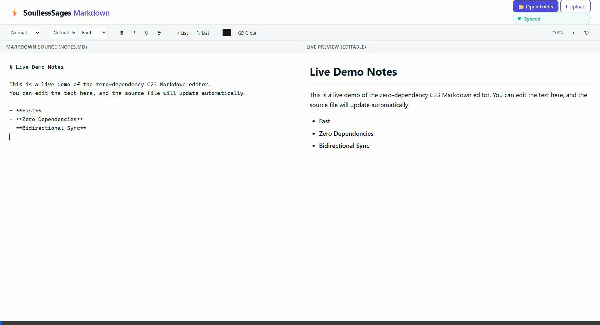

# Zero-Dep Markdown Viewer / Visualizer — Desktop App

> **Track B — Parsers & Data Formats**  
> Zero Dependency Hackathon (zerodepshack.com) · Aug 28–31 2026 · 72h · stdlib-only  
> **Target:** Native Windows & Linux Desktop Application (C23, zero third-party dependencies)

### [🎬 Live Demo Video (Bidirectional Sync + Zero-Dependency Proof)](demo.webp)


A zero-dependency desktop Markdown editor with **bidirectional sync**: edit the rendered preview and the source `.md` updates in real time — and vice versa. Built in pure C23 for Linux and Windows. Running the executable automatically launches the local desktop UI window with no Electron, no WebView2 NuGet packages, and no frameworks.

---

## What Makes It Different

| Typical MD viewer | This project |
|---|---|
| Heavy desktop stack (Electron ~150MB, Node, Chromium deps) | **Zero dependencies** — pure C23 desktop app (~1MB binary) |
| One-way: source → preview | **Bidirectional**: source ↔ preview |
| Depends on `marked`, `turndown`, `express`, `ws` | **Zero dependencies** — hand-rolled parsers & socket engine |
| Silent failure on bad syntax | **Compiler-style error reporting** — caret-annotated `line 14, col 3: unterminated code fence` |
| Read-only preview | **Contenteditable preview** that serializes back to Markdown |
| "We wrote tests" | 89.57% CommonMark conformance, fuzz-tested round-trip fixed point, gcov coverage reported per core file |

---

## Quick Start

### Linux Desktop
```bash
# Build modular executable
cd src-c && make && ./mdview ./notes.md

# Or Unity/Amalgamated build (Unity Build compilation)
cd src-c && make single && ./mdview_single ./notes.md
```

### Windows Desktop
```powershell
# Build with MinGW / GCC (or MSVC nmake / cl.exe)
cd src-c; mingw32-make; .\mdview.exe .\notes.md

# Or Unity/Amalgamated build on Windows
cd src-c; mingw32-make single; .\mdview_single.exe .\notes.md
```

*Executing `mdview` automatically initializes the local backend and launches the desktop editor view on both Windows and Linux.*

---

## Language & Platform Decision

**Decision: C (C23) with cross-platform Win32 & POSIX abstraction (`platform.h`), confirmed.** No C++, no Electron, and no third-party desktop wrappers. Sockets use POSIX `<sys/socket.h>` on Linux and Winsock2 `<winsock2.h>` on Windows. Atomic writes use `rename()`/`fsync()` on Linux and `MoveFileExA()`/`FlushFileBuffers()` on Windows. Desktop launch invokes `fork()` + `execvp("xdg-open", ...)` on Linux and `ShellExecuteA()` on Windows with manual console fallback. ASan/UBSan is covered by the `make asan` target.

| Criterion | C |
|---|---|
| **Craft / impressiveness** | Raw sockets, hand-rolled HTTP, manual memory mgmt |
| **Scoring potential** | High — strong Package Killer narrative |
| **Time risk** | Higher on HTTP layer — budgeted 10–12h, not 8h |
| **Track B alignment** | Parser pair dominates; C adds Track C-adjacent craft via the HTTP layer |

---

## Feature Scope

### In (v1)
- Headings `h1–h6`
- Bold `**text**`, italic `*text*`, bold-italic `***text***`
- Unordered lists `- item`, ordered lists `1. item`
- Code fences ` ```lang\ncode\n``` ` and inline code `` `code` ``
- Blockquotes `> text`
- Links `[text](url)`
- Paragraphs & line breaks
- Bidirectional sync (edit preview → rewrite `.md`)
- Compiler-style line/col/caret error reporting in tokenizer and parser
- Debounced atomic file writes (150–300ms)
- Overlapping inline delimiters (`**a *b** c*`) → **defined as an error**, not silently resolved (see ARCHITECTURE.md)
- List renumbering on serialize → **always sequential**, original numbers not preserved (see ARCHITECTURE.md)
- Tables (GFM pipe tables: simple header/data rows, no colspan or rowspan)

### Out (v1 — protect the 72h)
- Footnotes
- Deep nesting edge cases (>3 levels)
- General-purpose HTML→MD (scoped to our own renderer's tag vocabulary only)

### Stretch (only if Phase 5 closes by hour 64 — see TASKS.md gate)
- WebSocket: hand-rolled RFC 6455 upgrade + frame parser for live push sync

---

## Architecture at a Glance

```
┌─────────────────────────────────────────────────────────────┐
│  Browser (vanilla HTML/CSS/JS — no frameworks)              │
│  ┌──────────────┐              ┌──────────────────────────┐  │
│  │ <textarea>   │ ──POST /render {md} ──→ │ <div contenteditable> │  │
│  │  (source)    │              │  (live preview)         │  │
│  └──────────────┘              └──────────────────────────┘  │
│         ↑                            │                      │
│         └──── POST /serialize {html} ┘                      │
└─────────────────────────────────────────────────────────────┘
                              │
                    ┌─────────┴─────────┐
                    │   Server (C)       │
                    │  · raw socket HTTP │
                    │  · md_to_html()    │  ← recursive-descent parser
                    │  · html_to_md()    │  ← DOM-tag walker
                    │  · atomic writer   │
```

---

## Concurrency Model

Our desktop server runs a **single-threaded blocking accept loop** with **synchronous per-connection I/O**.
*   **Listener Socket:** The listener socket is kept in blocking mode. When `platform_accept` is called, the execution path blocks until a new client connects.
*   **Graceful Shutdown:** To exit cleanly, signal handlers on both Windows (`SetConsoleCtrlHandler`) and Linux (`sigaction` for `SIGINT`/`SIGTERM`) close the global listener socket. This forces the blocked `accept()` call to return immediately with an error, allowing the server to clean up resources, run `atexit()` handlers (writing gcov coverage `.gcda` files), and terminate gracefully.
*   **Connection Processing:** Each client request is parsed, routed, and responded to synchronously within the main thread, closing the connection immediately via `Connection: close` (no keep-alive support).

## Project Structure

```
ZeroDependency/
├── README.md
├── ARCHITECTURE.md
├── PRD.md
├── TASKS.md
├── SKILLS.md
├── WORK_SPLIT.md
├── STDLIB.md                # Package Killer narrative for judges
├── LIBRARIES_AND_HEADERS.md
├── deps-proof.txt           # required: proof of zero third-party runtime deps
├── .zero-dep.toml           # required: track letter + one-line pitch
├── LICENSE                  # MIT license
├── Makefile                 # root-level build (make / make test / make asan / make coverage / make fuzz)
├── gen-deps-proof.sh        # regenerates deps-proof.txt on Linux
├── gen-deps-proof.ps1       # regenerates deps-proof.txt on Windows
├── src-c/
│   ├── Makefile             # `cd src-c && make` (Quick Start path)
│   ├── main.c              # entry point, CLI arg parsing, desktop app launcher
│   ├── platform.c / .h     # Windows (Win32/Winsock2) & Linux (POSIX) abstraction
│   ├── http.c / .h         # cross-platform raw socket server, request parser
│   ├── md_parser.c / .h    # recursive-descent Markdown → HTML
│   ├── html_serializer.c / .h  # HTML → Markdown (scoped tag walker)
│   ├── tokenizer.c / .h    # line/col tracking tokenizer (used by md_parser)
│   ├── error_report.c / .h # compiler-style caret-annotated error formatting
│   ├── file_writer.c / .h  # debounced atomic writes (fsync / FlushFileBuffers)
│   ├── mdview_single.c     # amalgamated unity translation unit build (make single)
│   └── static/             # index.html, styles.css, client.js (local desktop UI)
└── tests/
    ├── test_harness.h       # hand-rolled test macros (no Unity/GoogleTest)
    ├── test_parser.c        # md_parser unit tests
    ├── test_html_serializer.c
    ├── test_http.c          # HTTP routing and payload edge cases
    ├── test_platform.c      # socket lifecycle, atomic write, browser fallback
    ├── test_file_writer.c   # debounce collapse, atomicity crash, error path
    ├── fuzz_roundtrip.c     # 5-minute time-budgeted round-trip fixed-point fuzzer
    ├── commonmark/          # CommonMark spec.json + conformance runner
    ├── integration_tests.sh # curl-based server integration tests (Linux)
    └── integration_tests.ps1 # curl-based server integration tests (Windows)
```

---

## License

MIT License — Copyright (c) 2026. See [LICENSE](LICENSE) for full text.

## Required Submission Artifacts (per zerodepshack.com rules)

- Public GitHub repo, OSI-approved license
- Build command that produces a runnable artifact in one step
- Empty dependency manifest for C (no `package.json`/`Cargo.toml`/etc. — N/A for C, but `deps-proof.txt` still required)
- `deps-proof.txt` — command output or build log showing zero third-party runtime deps
- `.zero-dep.toml` — track letter (`B`) and one-line pitch
- `README.md` / `STDLIB.md` (this repo)
- **5-minute demo video — required, not optional** — must show the tool working AND the empty manifest/deps-proof

---

## Key Design Decisions

1. **Client is a dumb terminal** — all parsing/serializing lives server-side. The server is single-language C; `static/client.js` is plain browser-native JS with no manifest, framework, or install step of its own — inherent to being a web client, not a second "dependency language."
2. **No WebSocket for MVP** — debounced HTTP POST is imperceptible on localhost and avoids hand-rolling RFC 6455 framing; promoted to a gated stretch goal only if core phases finish on schedule.
3. **Reverse serializer is scoped** — only understands tags our own renderer emits. Turns "solve arbitrary HTML→MD" into "walk a small known tag set."
4. **Error reporting tracks line/col and renders a caret-annotated snippet**, compiler-style, so malformed input fails loudly and legibly.
5. **Correctness is provable, not just asserted** — CommonMark conformance percentage and a round-trip fixed-point fuzzer back up the bidirectional-sync claim with numbers a judge can rerun.

---

## Correctness & Craft Evidence

| Claim | Evidence |
|---|---|
| Parser is spec-aligned | CommonMark `spec.json` conformance run — **584/652 tests passed (89.57%)** (all core Markdown syntax covered; raw multi-line HTML block tags `<script>`, `<iframe>`, `<div>`, etc. are explicitly excluded as out-of-scope for security and local desktop Markdown viewer safety) |
| Bidirectional sync actually converges | Fuzzer asserts `render(html_to_md(md_to_html(x)))` is a fixed point after one round trip |
| Sanitizer check | `make asan` builds with ASan/UBSan and runs parser, serializer, platform, writer, integration, and fuzz smoke tests |
| Test depth | `make coverage` reports high per-file gcov line coverage across core modules (`md_parser.c`, `html_serializer.c`, `platform.c`, `file_writer.c`, `http.c`, `main.c`) |

---

## Scoring Strategy (official weights, confirmed against zerodepshack.com/#scoring)

| Category | Weight | How we hit it |
|---|---|---|
| Functionality & Usefulness | 35% | Parser pair correctness (CommonMark conformance %), bidirectional sync, edge-case handling — builds with one command, does something real |
| Zero-Dependency Craft | 30% | Empty manifest verified; STDLIB.md depth/honesty — raw sockets (C), hand-rolled recursive descent, scoped DOM walker, fuzz + sanitizer clean |
| Code Quality & Idiom | 25% | Reads as idiomatic C to a senior reviewer, not a fight against the standard library; clean error handling; sensible module structure |
| Innovation | 10% | Both directions round-tripping live to a proven fixed point; gated WebSocket stretch |

### Bonus challenges (we select Package Killer & STDLIB Log for +6 pts total)

| Challenge | Difficulty | Pts | Fit for this project |
|---|---|---|---|
| **Package Killer** | Medium | +3 | **Selected** — 4-5 major package substitutions successfully completed and documented. |
| **STDLIB Log** | Medium | +3 | **Selected** — Includes 15 detailed non-trivial stdlib package substitutions in [STDLIB.md](STDLIB.md). |
| Reproducible Build | Hard | +5 | Worth evaluating — build twice, byte-identical output, publish both hashes. |
| Single File | Hard | +5 | No — `mdview_single.c` is provided as an amalgamated **Unity Build** (includes all modular `.c` files directly) for optimized compilation and binary size, but we do not claim the Single File bonus since we preserve a modular directory structure. |

---

## License

MIT License — see [LICENSE](LICENSE) for details.
