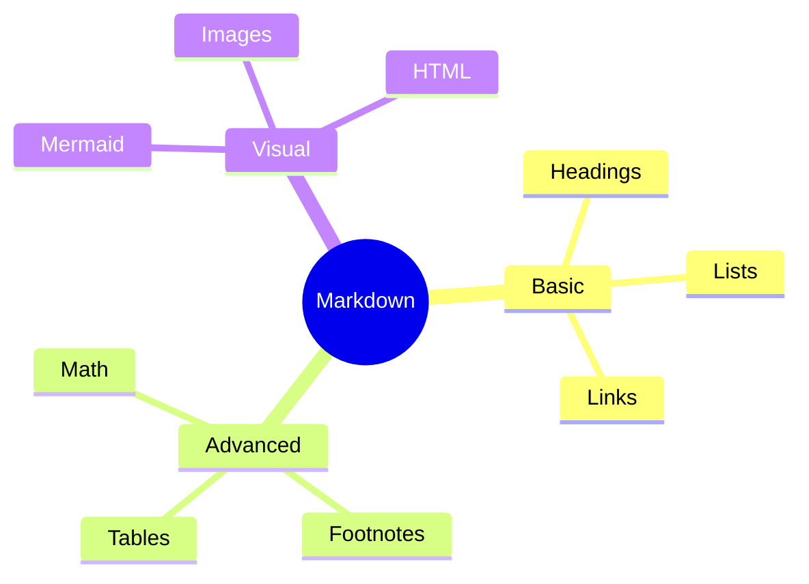

# Markdown Stress Test 🚀

This file tests complex nesting, long content structures, unusual characters, and renderer edge cases.

## 1\. Deeply Nested Lists

1. Level 1
   1. Level 2
      1. Level 3
         1. Level 4
            1. Level 5
               - Mixed unordered item
                 - Another nested item
                   - Very deep item

---

## 2\. Complex Task List

- \[x\] Install Markdown viewer
  - \[x\] Open file
  - \[x\] Render headings
    - \[x\] Render nested content
- \[ \] Test unsupported features
  - \[ \] Math
  - \[ \] Mermaid
  - \[ \] HTML

---

## 3\. Complex Blockquote

> # Quote Heading
>
> This quote contains **bold**, *italic*, and `code`.
>
> - List item
> - Another item
>
> > Nested quote
> >
> > ```python
> > print("Code inside quote")
> > ```

---

## 4\. Large Table

| \# | Feature | Input | Expected |
|---|---|---|---|
| 1 | Bold | `**text**` | **text** |
| 2 | Italic | `*text*` | *text* |
| 3 | Code | ``text`` | `text` |
| 4 | Strike | `~~text~~` | ~~text~~ |
| 5 | Link | Markdown link | [Example](https://example.com) |
| 6 | Emoji | Unicode | 🚀 |
| 7 | Currency | INR | ₹ |
| 8 | Unicode | Kannada | ಕನ್ನಡ |

---

## 5\. Code Syntax Stress Test

```c
#include <stdio.h>

int main() {
    printf("Hello from C!\n");
    return 0;
}
```

```cpp
#include <iostream>

int main() {
    std::cout << "Hello from C++" << std::endl;
    return 0;
}
```

```java
public class Main {
    public static void main(String[] args) {
        System.out.println("Hello from Java");
    }
}
```

```json
{
  "name": "Markdown Test",
  "version": 1,
  "features": ["tables", "math", "mermaid"]
}
```

```yaml
application:
  name: Markdown Tester
  enabled: true
  features:
    - headings
    - tables
    - diagrams
```

```sql
SELECT feature, status
FROM markdown_tests
WHERE supported = true;
```

---

## 6\. Tricky Markdown Characters

# This should be a heading

\# This should NOT be a heading

\*This should not be italic\*

\_This should not be italic\_

Backticks: `Use `inline code` inside`

Asterisks: ***bold italic***

Underscores: ***horizontal rule above/below depending on parser***

---

## 7\. Link Variations

[Normal link](https://example.com)

[Link with title](https://example.com "Example Website")

[mailto:test@example.com](mailto:test@example.com)

[https://example.com/path?query=test&value=123#section](https://example.com/path?query=test&value=123#section)

Reference style:

[Reference Link](https://example.com "Reference example")

---

## 8\. Image Tests


<div class="broken-image-placeholder" title="Image source: missing-image-file.png"><span class="broken-img-icon">🖼️</span><div class="broken-img-meta"><span class="broken-img-alt">Broken image test</span><span class="broken-img-src">missing-image-file.png</span></div></div>

---

## 9\. HTML Edge Cases

<details open="">
<summary>Open by default</summary>
This tests the `open` attribute.

</details>
\
---

<center>This text uses deprecated HTML centering.</center>
---

## 10\. Mermaid Mindmap



---

## 11\. Unicode Stress Test

### Indian Languages

- English: Hello
- ಕನ್ನಡ: ನಮಸ್ಕಾರ
- தமிழ்: வணக்கம்
- हिन्दी: नमस्ते
- తెలుగు: నమస్కారం
- বাংলা: নমস্কার

### Other Languages

- 日本語: こんにちは
- 한국어: 안녕하세요
- العربية: مرحبا
- Ελληνικά: Γειά σου
- Русский: Привет

### Symbols

∞ ≈ ≠ ≤ ≥ ± × ÷ √ ∑ ∏ ∫

♠ ♥ ♦ ♣ ★ ☆ ✓ ✗

---

## 12\. Final Rendering Checklist

- \[ \] Are headings rendered?
- \[ \] Are tables aligned?
- \[ \] Does syntax highlighting work?
- \[ \] Do images load?
- \[ \] Do links open?
- \[ \] Does math render?
- \[ \] Does Mermaid render?
- \[ \] Does HTML work?
- \[ \] Do Unicode characters display correctly?
- \[ \] Does the renderer remain responsive?

# 🎯 Stress Test Complete

If your application renders this entire file correctly, it has excellent extended Markdown support.

